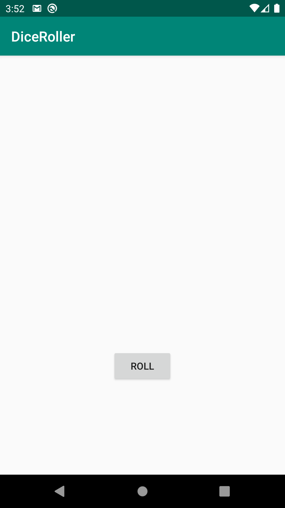
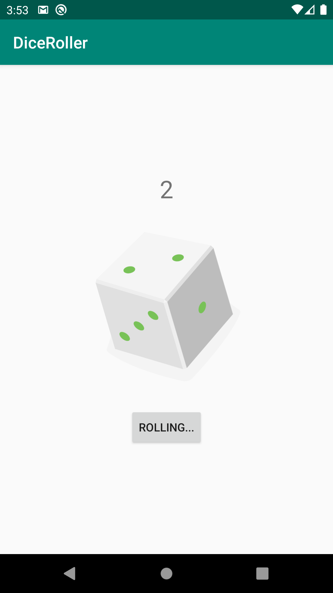
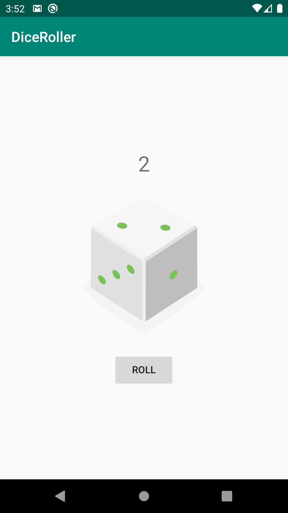

# DiceRoller

## Learning about:
* Explore the basics of Android, such as creating text, images, and interactive buttons
* Set up the development environment and create a Dice Roller Android app
* Navigate the Main Map Anatomy of an Android app

## Screenshots:

